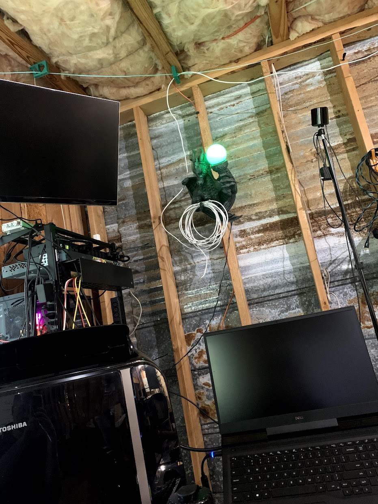

# Bandwidth Dragon

Once upon a time a store called Spencers Gifts existed. I think it probably still does, but malls don't exactly exist in my mind anymore. When I was a teenager, I was a bit of a mall rat due to an addiction to [Pump It Up](https://en.wikipedia.org/wiki/Pump_It_Up_(video_game_series)). Since I had a (small) disposable income as a teenager with a job and a car, I had the pleasure to buy strange things. I am also a bit of a nerd, so I got a dragon lamp.

I used to take this thing to a local LARP (yeah, that much of a nerd) and hang it on the wall as a mood light.

Here's a photo of the dragon today:

{ width="600" }

One thing to note, the lamp part of this dragon is completely redone. I wanted an art project to flex my creative bone and that's what this project is about.

## What is it?

I found this dragon in a box when moving into my new house. After opening the globe-like lamp to replace the bulb, a thought went through my mind. "Why would you use a tiny christmas light in this thing?" A friend introduced me to [neopixels LED's](https://www.adafruit.com/product/1138?length=2) in the past and I wanted to use one to make this globe really shine.

## Hardware

I needed a way to use a raspberry pi zero w and a neopixel ring together. Because +5V is native to the raspberry pi, the 3V data path the neopixel ring operates on requires a level stepper to accomplish and properly address each light in the array. Lucky for me, the chip shortage didn't start yet so I got a few from adafruit.

Build requirements:

- 74AHCT125 - Quad Level-Shifter (3V to 5V) (1)
- 5V 4A (4000mA) switching power supply
- NeoPixel Ring - 12 x 5050 RGB LED with Integrated Drivers
- Breadboard
- Flux
- Solder
- Soldering Iron

## Wiring Diagram

Once I had all the hardware, the wiring was pretty simple:


From: <https://learn.adafruit.com/neopixels-on-raspberry-pi/raspberry-pi-wiring>

I soldered the components together and stuffed a raspberry pi zero w inside as the brain of my little dragon friend.

## I have a functioning linux lamp, now what?

Now that I have everything together I need to create an application to control the lights. Recently, I had equipped the home network with a Ubiquity Dream Machine Pro (or UHD for now on). The UHD can run docker (actually podman) containers quite easily and netdata provides an API to get data back. With those things known, the decision is easy. This lamp will monitor my bandwidth!

Now that I am thinking back on it, I should have made it react to the weather. Maybe for a future project...

## The Code

From: <https://github.com/f0rkznet/odahviing>

``` py linenums="1"
import time
import board
import neopixel
import random
import numpy as np
import os
import requests

pixel_pin = board.D18
num_pixels = 12
ORDER = neopixel.GRB

pixels = neopixel.NeoPixel(
    pixel_pin,
    num_pixels,
    auto_write=False,
    pixel_order=ORDER,
)

def blue_dragon(pos):
    if pos < 0 or pos > 255:
        r = g = b = 0
    elif pos < 85:
        r = 0
        g = 0
        b = int(pos * 3)
    elif pos < 170:
        pos -= 85
        r = 0
        g = 0
        b = int(255 - pos * 3)
    else:
        pos -= 170
        r = 0
        g = 0
        b = 0
    return (r, g, b) if ORDER in (neopixel.RGB, neopixel.GRB) else (r, g, b, 0)

def green_dragon(pos):
    if pos < 0 or pos > 255:
        r = g = b = 0
    elif pos < 85:
        r = 0
        g = int(pos * 3)
        b = 0
    elif pos < 170:
        pos -= 85
        r = 0
        g = int(255 - pos * 3)
        b = 0
    else:
        pos -= 170
        r = 0
        g = 0
        b = 0
    return (r, g, b) if ORDER in (neopixel.RGB, neopixel.GRB) else (r, g, b, 0)

def red_dragon(pos):
    # Input a value 0 to 255 to get a color value.
    # The colours are a transition r - g - b - back to r.
    if pos < 0 or pos > 255:
        r = g = b = 0
    elif pos < 85:
        r = int(pos * 3)
        g = 0
        b = 0
    elif pos < 170:
        pos -= 85
        r = int(255 - pos * 3)
        g = 0
        b = 0
    else:
        pos -= 170
        r = 0
        g = 0
        b = 0
    return (r, g, b) if ORDER in (neopixel.RGB, neopixel.GRB) else (r, g, b, 0)

def chromatic_dragon(pos):
    if pos < 0 or pos > 255:
        r = g = b = 0
    elif pos < 85:
        r = int(pos * 3)
        g = int(255 - pos * 3)
        b = 0
    elif pos < 170:
        pos -= 85
        r = int(255 - pos * 3)
        g = 0
        b = int(pos * 3)
    else:
        pos -= 170
        r = 0
        g = int(pos * 3)
        b = int(255 - pos * 3)
    return (r, g, b) if ORDER in (neopixel.RGB, neopixel.GRB) else (r, g, b, 0)

def chromatic_cycle():
    for j in range(255):
        for i in range(num_pixels):
            pixel_index = (i * 256 // num_pixels) + j
            pixels[i] = chromatic_dragon(pixel_index & 255)
        pixels.show()

def blue_cycle():
    for j in range(255):
        for i in range(num_pixels):
            pixel_index = (i * 256 // num_pixels) + j
            pixels[i] = blue_dragon(pixel_index & 255)
        pixels.show()

def red_cycle():
    for j in range(255):
        for i in range(num_pixels):
            pixel_index = (i * 256 // num_pixels) + j
            pixels[i] = red_dragon(pixel_index & 255)
        pixels.show()

def green_cycle():
    for j in range(255):
        for i in range(num_pixels):
            pixel_index = (i * 256 // num_pixels) + j
            pixels[i] = green_dragon(pixel_index & 255)
        pixels.show()

def get_rate(netdata_host, chart):
    d = {'chart': chart}
    r = requests.get(url=f'http://{netdata_host}/api/v1/data', params=d)
    # The network chart is in kilobit/s
    rate = int(r.json().get('data')[0][1]) / 1000
    percent_rate = (rate / 1000) * 100
    return percent_rate


if __name__ == '__main__':
    while True:
        if_rate = get_rate('10.250.1.1:19999', 'net.eth8')
        print(if_rate)
        for _ in range(1):
            if if_rate <= 25:
                green_cycle()
            elif if_rate <= 50 and if_rate > 25:
                blue_cycle()
            elif if_rate <= 75 and if_rate > 50:
                chromatic_cycle()
            elif if_rate <= 100 and if_rate > 75:
                red_cycle()
```

## Conclusion

I was happy how this turned out. Now that I am thinking about this project in retrospective, I think I want to create another script that will change the lighting based on the current weather conditions and time. I'll post more about it when the development starts!
